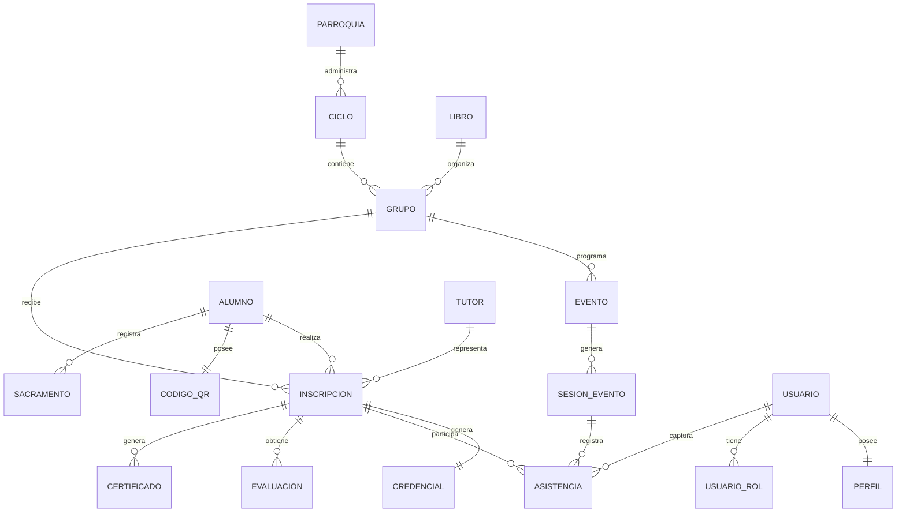
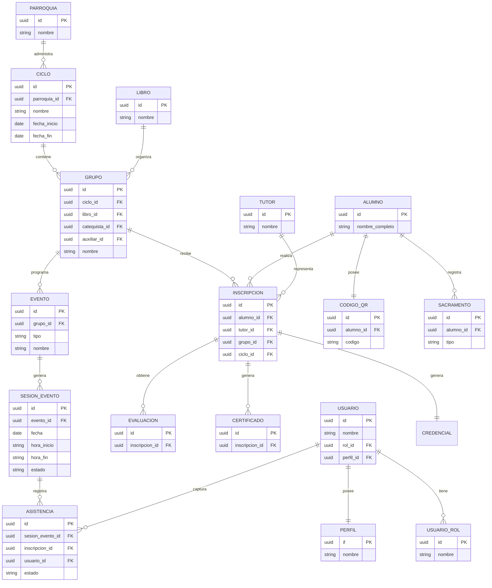

# Entity Relationship Diagram (ERD)

**Proyecto:** SIGCA - Sistema Integral de Gestión Catequética

**Versión:** 1.0

**Estado:** Aprobado

**Fecha:** 08/Jul/2026

---

# Objetivo

Representar gráficamente el modelo entidad-relación del dominio de SIGCA.

Este documento complementa el modelo conceptual (`entity-relationship-model.md`) y servirá como base para el diseño físico de PostgreSQL y las migraciones de Supabase.

---

# Diagrama Conceptual



---

# Diagrama Relacional



---

# Flujo Principal del Dominio

```text
Parroquia
      │
      ▼
Ciclo
      │
      ▼
Libro
      │
      ▼
Grupo
      │
      ▼
Inscripción
 ┌────┼──────────────┬──────────────┐
 ▼    ▼              ▼              ▼
Tutor Credencial  Evaluación   Certificado
 │
 ▼
Alumno
 │
 ├─────────────► Código QR
 │
 └─────────────► Sacramentos

Evento
   │
   ▼
Asistencia

                 USUARIO
                    │
        ┌───────────┴────────────┐
        │                        │
        ▼                        ▼
     PERFIL                 USUARIO_ROL
        │
        │
        └───────────────────────────

USUARIO
   │
   ▼
ASISTENCIA
```

---

# Observaciones de Diseño

## 1. La entidad central del modelo es **Inscripción**.

Toda la operación anual del sistema depende de esta entidad.

---

## 2. Alumno representa únicamente a la persona.

Los cambios de grupo, tutor, libro o ciclo no modifican la información permanente del Alumno.

---

## 3. El Código QR pertenece al Alumno.

No pertenece al Grupo, al Ciclo ni a la Credencial.

---

## 4. Toda asistencia pertenece a un Evento.

Una Clase y una Misa son simplemente distintos tipos de Evento.

Esto permite agregar nuevos eventos sin modificar el modelo.

---

## 5. El historial nunca se pierde.

Cada nueva reinscripción genera un nuevo registro, preservando la información histórica.

---

# Evolución Prevista

El modelo fue diseñado para soportar futuras ampliaciones sin romper la estructura principal:

* Múltiples parroquias.
* Nuevas sedes.
* Nuevos sacramentos.
* Más tipos de eventos.
* Portal para padres.
* Aplicación móvil.
* Integraciones con otros sistemas.

---

# Resultado Esperado

Este diagrama constituye la representación oficial del dominio de datos de SIGCA y será la referencia para:

* Diseño físico en PostgreSQL.
* Migraciones de Supabase.
* Repositorios del backend.
* APIs REST.
* Frontend.
* Reportes.
* Auditoría.
